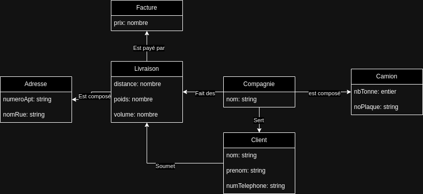

# Cours de Bases de données - Semaine 1, Cours 1
Ce cours de bases de données à l'ÉTS a couvert les bases de données à travers quelques exemples.


## Contenu du cours

### Fonctionnalitées d'un SGBD (*Système de Gestion de Base de Données*)

* Stockage, accès et mise à jour des données
* Support transactionnel
* Services de contrôle des accès concurrents
* Services de recouvrement
* Services de contrôle d’accès aux données
* Service de validation et de maintien d’intégrité des données
* Interface de communication des données
* Service de maintien et d’accès à un catalogue de métadonnées
* Et d’autres... (reporting, etc.)

### Exemple de modèle conceptuel ([draw.io](https://draw.io))

[](modele_conceptuel.drawio)

### Démonstration de SQL

```sql
SET ECHO ON

CREATE TABLE Client (
    noClient		INTEGER PRIMARY KEY,
    nomClient 		VARCHAR(18),
    adresseClient	VARCHAR(20),
    noTelephone 	VARCHAR(15)
)

CREATE TABLE Compte (
    noCompte 		INTEGER PRIMARY KEY,
    solde	 		DECIMAL(10,2) CHECK (solde >= 0),
    dateOuverture 	DATE,
    noClient		INTEGER REFERENCES Client
)

CREATE TABLE Pret (
    noPret 			    INTEGER PRIMARY KEY,
    montantPret 	    DECIMAL(10,2),
    dateDebut 		    DATE,
    tauxInteret		    DECIMAL(8,2),
    frequencePaiement	INTEGER,
    noClient		    INTEGER REFERENCES Client
)

INSERT INTO Client 
 	VALUES(10,'Luc Sansom','Ottawa','(999)999-9999')

SELECT * FROM Client

INSERT INTO Client 
 	VALUES(20,'Dollard Tremblay','Montreal','(888)888-8888')

INSERT INTO Client 
 	VALUES(30,'Lin Be','Montreal','(777)777-7777')

ALTER SESSION SET NLS_DATE_FORMAT = 'DD/MM/YYYY'

INSERT INTO Compte 
 	VALUES(100,1000.0,'5/5/1999',10)

INSERT INTO Compte 
 	VALUES(200,2000,'10/10/1999',20)

INSERT INTO Compte 
 	VALUES(300,1000,'10/10/1999',10)

INSERT INTO Compte 
 	VALUES(400,5,'20/7/2000',30)

INSERT INTO Compte 
 	VALUES(600,10,'15/10/2000',30)

INSERT INTO Pret 
 	VALUES(1000,10000,'10/6/2000',10,12,10)

INSERT INTO Pret 
 	VALUES(2000,20000,'20/7/2000',12,52,30)

INSERT INTO Pret 
 	VALUES(3000,5000,'15/8/2000',12,12,10)

COMMIT

INSERT INTO Client 
 	VALUES(10,'Jean Leconte','Montreal','(666)666-6666')

SELECT 	noCompte, solde
FROM 	Compte
WHERE 	noClient = 10

SELECT 	nomClient, noCompte, solde
FROM 	Client, Compte
WHERE 	Client.noClient = Compte.noClient AND dateOuverture = '10/10/1999'

UPDATE Compte
SET solde = solde - 100
WHERE noCompte = 100

UPDATE Compte
SET solde = solde + 100
WHERE noCompte = 300

COMMIT

SELECT 	noCompte, solde
FROM 	Compte
WHERE 	noClient = 10

DELETE FROM Compte WHERE noCompte = 100

COMMIT

SELECT * FROM Compte

CREATE INDEX indexNoClientCompte ON Compte(noClient)

SELECT 	noCompte, solde
FROM 	Compte
WHERE 	noClient = 10

SELECT TABLE_NAME 
FROM USER_TABLES

SELECT COLUMN_NAME
FROM USER_TAB_COLUMNS
WHERE TABLE_NAME = 'CLIENT'

DESCRIBE CLIENT

SELECT TABLESPACE_NAME, EXTENTS, BLOCKS
FROM USER_SEGMENTS
WHERE SEGMENT_NAME = 'CLIENT'

DROP TABLE Compte

DROP TABLE Pret

DROP TABLE Client
```